# 滑雪+聚餐+温泉 团建攻略

 +
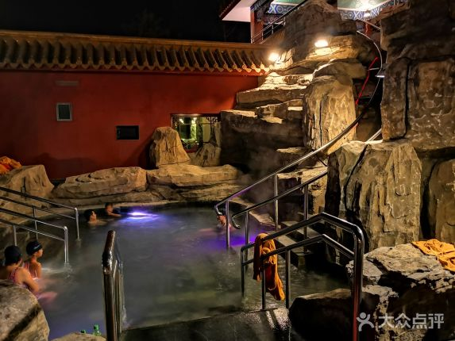 +
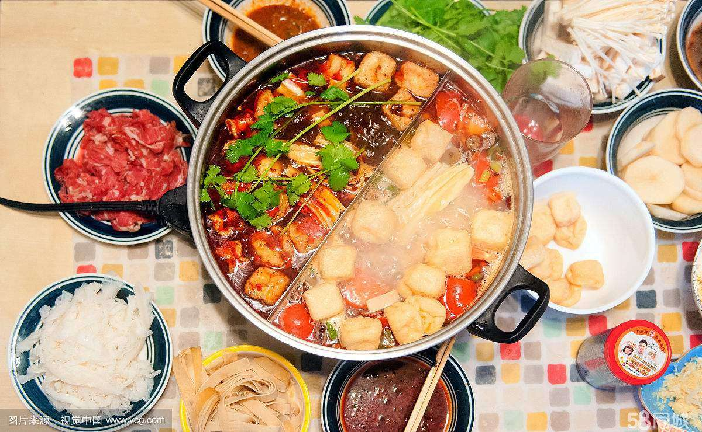 = 24 or 28 or 29 团建

## 滑雪大类
- 滑雪价格只包含雪票（含雪具），每人押金300可自选其他用具（雪服30，头盔，柜子20）建议自费
- 滑雪很累，一般人4小时适中

1. 军都山滑雪场

  - 价格：4小时150，全天180（8：00-17：00）
  - 场地条件：1高级2中级2初级
  - 交通条件：离最近地铁站打车费用小于20
  - 优点：有名的高级滑雪场地，满足所有滑雪需求，有咖啡厅
  - 缺点：价格稍贵，吃火锅或其他聚餐需要到地铁口

2. 静之湖滑雪场

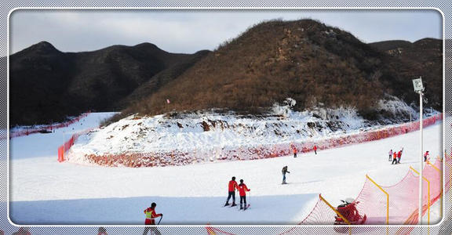

  - 价格：全天60（9：00-16：00）
  - 场地条件：1中级2初级
  - 交通条件：打车到西二旗地铁站100+，到最近地铁站50+
  - 优点：中级+初级满足大部分滑雪需求，和静之湖汤泉套票价格合适
  - 缺点：交通不便，离地铁远

3. 温都水城滑雪场

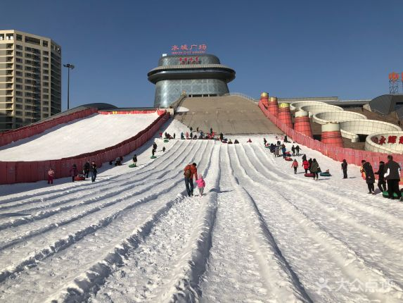

  - 价格：未知（网上评论价格有贵的也有便宜的，美团上1小时69算贵的）
  - 场地条件：据说是1高1中1初（继续调查)
  - 交通条件：距离市区最近
  - 优点：交通方便，滑雪+温泉+火锅可以容易的达成
  - 缺点：雪道和温泉的评价略逊于其他选项，评价集中于亲子

## 聚餐大类

1. 军都山
  - 附近没有比较好的火锅或吃饭地方，需要到地铁口附近

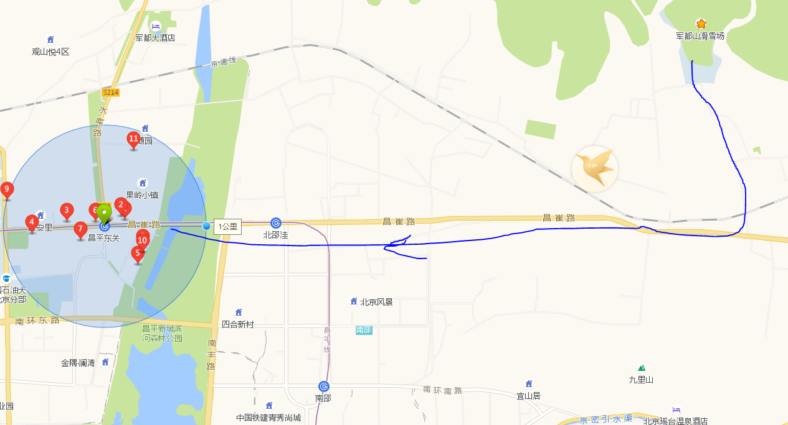

2. 静之湖
  - 滑雪场内有平价餐厅
  - 可以在酒店内餐厅就餐，可能没有火锅

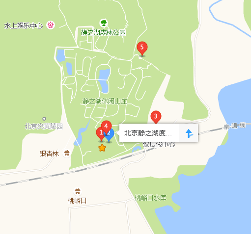

3. 温都水城
  - 附近餐厅较多，无论是温泉套票还是单独找地方吃都不错

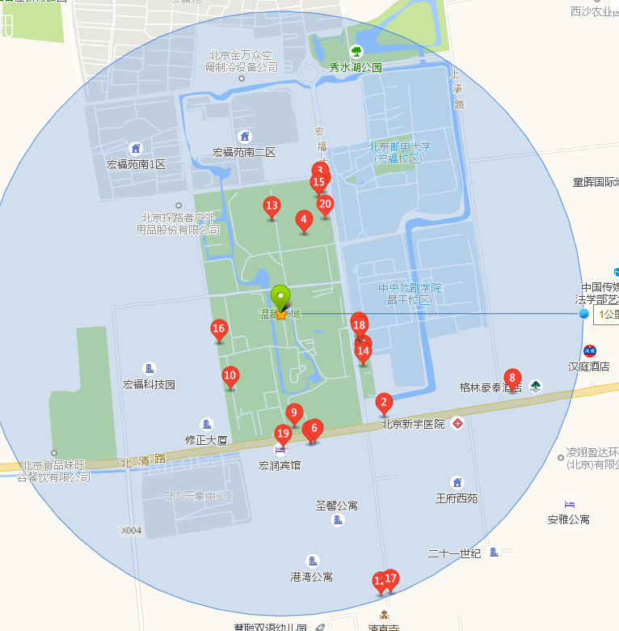

## 温泉大类
1. 静之湖汤泉

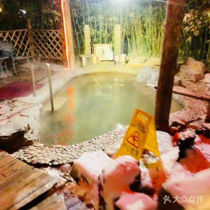
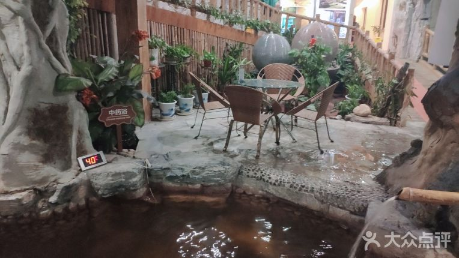
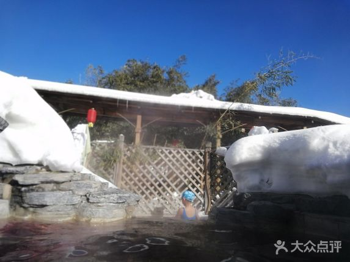
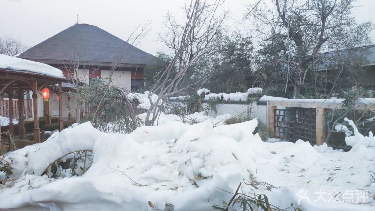

  - 价格：套票169（滑雪+温泉）
  - 评价 800评论 水质：8.6 环境：9.0 服务：8.7
  - 集中意见：人造雪景好，室外环境优雅

2. 九华山庄主题公园

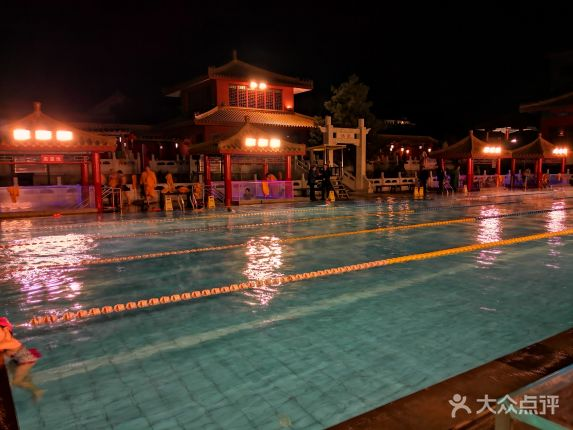

  - 价格 全天128，夜场78
  - 评价 3k评论 水质：8.6 环境：8.6 服务：8.0
  - 餐饮 5点开餐（有餐厅）
  - 集中意见：室外温泉种类多，设施稍老

3. 温都水城

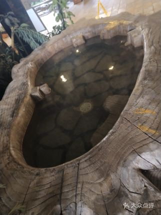
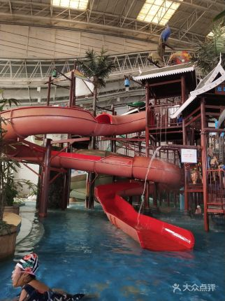
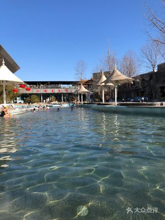
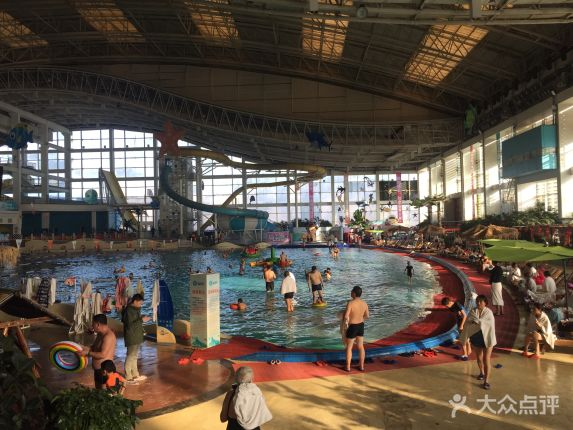

  - 价格：温泉+室外温泉128，温泉+火锅178
  - 评价 3k评论 水质：7.2 环境：7.3 服务：7.2
  - 餐饮 套票火锅，或者自选餐厅（周围有10+火锅店）
  - 集中意见：室内温泉种类和服务还行，室外温泉种类少，有室外热水泳池

## 出行与时间

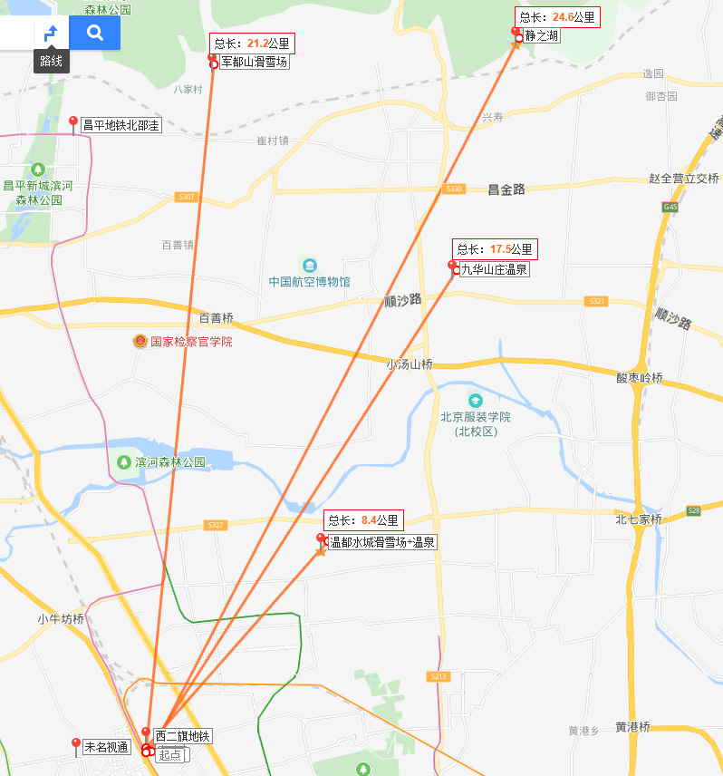

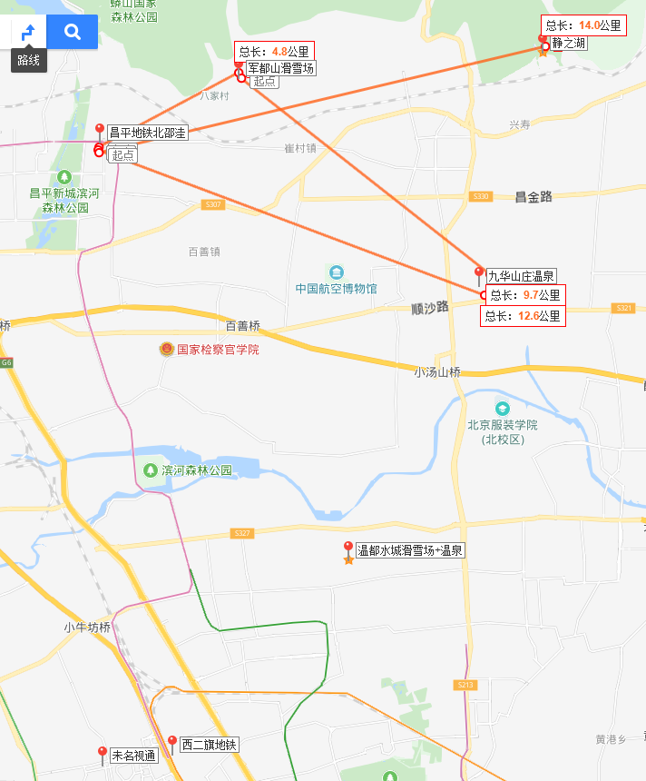

## 套餐
1. 高端大气3选2
  - 军都山滑雪180 + 餐100 + 行50
  - 能玩的人越多，玩的越high

2. 舒适温暖型3选2
  - 九华山庄温泉130 + 餐100 + 行50
  - 舒缓不累，可以吃两顿以上好餐

3. 优雅全能型
  - 静之湖一套170 + 餐100 + 出行80
  - 人少玩得爽环境优雅，出行需要有足够的车

4. 方便全能型
  - 温都水城一套(含火锅）178+ 滑雪150（暂定）+ 出行20
  - 离市区近，干什么都方便

5. 就是要玩型
  - 军都山180 + 九华山庄78 + 出行50
  - 行程紧凑，避免集体聚餐，时间全用来玩